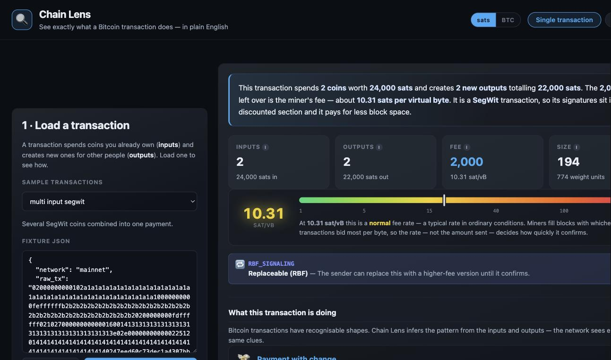
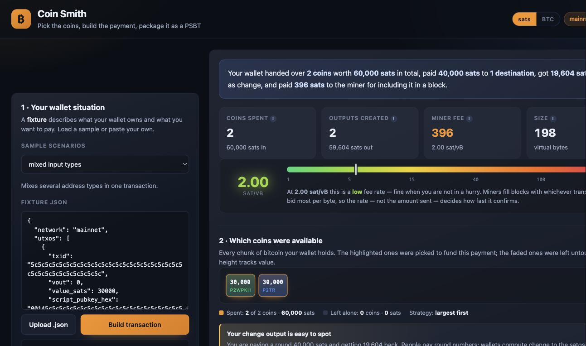

# Bitcoin Toolkit


Two tools that take a Bitcoin transaction apart and put one back together, plus a
landing page that ties them together and decodes real transactions in the browser.

| | |
|---|---|
| **Chain Lens** | Reads a transaction. Decodes raw hex or a whole `blk*.dat` file straight from Bitcoin Core, including the `rev*.dat` undo data needed to recover input values and fees. |
| **Coin Smith** | Builds a transaction. Selects coins, computes fee and change, applies dust and RBF/locktime rules, and emits a BIP-174 PSBT. |
| **Landing page** | Explains both, and decodes real mainnet transactions client-side — no server required. |

Built for the Summer of Bitcoin 2026 developer challenges.


---

## Quick start

```bash
./start.sh
```

| | |
|---|---|
| Landing page | `127.0.0.1:8080` |
| Chain Lens | `127.0.0.1:3222` |
| Coin Smith | `127.0.0.1:3333` |

Ports are overridable with `HOME_PORT`, `LENS_PORT` and `SMITH_PORT`. `Ctrl-C` stops all three.

Each project also runs standalone:

```bash
cd chain-lens  && ./setup.sh && ./web.sh      # or ./cli.sh <fixture.json>
cd coin-smith  && ./setup.sh && ./web.sh      # or ./cli.sh <fixture.json>
```

---

## Screenshots

**Chain Lens** — decodes a transaction and explains what it does, byte by byte.



**Coin Smith** — selects coins, works out fee and change, and warns about anything unsafe.



---

## Block fixtures

The `blk*.dat` and `rev*.dat` fixtures are **not in this repository** — they are
127 MB each, well past GitHub's 100 MB file limit. To run Chain Lens in block
mode, copy them into `chain-lens/fixtures/blocks/` from the original challenge
repository, then run `chain-lens/setup.sh` to decompress them.

Everything else — the transaction fixtures, both graders, and all tests — works
without them.

---

## What is interesting here

**Undo records are not stored in block order.** Bitcoin Core appends undo data
when a block is *connected*, which is not the order blocks were written to disk.
Pairing the *n*th record with the *n*th block mispaired 76 of 78 records in one
file and produced nonsense fees. Records are now matched structurally — by
bundle count and per-transaction input counts.

**A field order nobody documents.** `TxInUndoSerializer` writes
`VARINT(height * 2 + isCoinbase)`, then a single zero byte when the height is
non-zero, then the compressed amount and script. Missing that byte silently
shifts every field after it.

**Recovering a public key from half of it.** Core compresses P2PK scripts to an
x coordinate plus a parity bit. secp256k1's field has `p ≡ 3 (mod 4)`, so
`y = (x³ + 7)^((p+1)/4) mod p`, with the parity bit choosing between `y` and
`p − y`.

**Streaming a 133 MB file.** Emitting full per-transaction detail for every
block pushed the web server to 2.7 GB of heap. Parsing became a generator so
summaries stream and single blocks are re-read on demand by byte offset — peak
memory fell to 671 MB.

---

## Verification

| | |
|---|---|
| Chain Lens grader | transactions 6,376 assertions · blocks 5,026 assertions · **0 failures** |
| Coin Smith grader | 35 / 35 fixtures |
| Unit tests | 27 (Chain Lens) + 75 (Coin Smith) |
| Mainnet blocks parsed | 162 / 162 |

Beyond the graders, every block is checked against an independent invariant the
graders never test: `total_fees == coinbase_output − block_subsidy`.

```bash
cd chain-lens && ./grade.sh && npm test
cd coin-smith && ./grade.sh && npm test
```

---

## Layout

```
chain-lens/     transaction and block analyser
  src/parser/   tx, block, undo and script decoding
  src/utils/    buffer reader, hashing, addresses, opcodes
  src/web/      Express API and dashboard
coin-smith/     coin selection and PSBT builder
  builder.js    selection, fee/change, PSBT assembly
  public/       dashboard
home/           landing page with an in-browser decoder
start.sh        runs all three
```

---

## Licence

MIT
